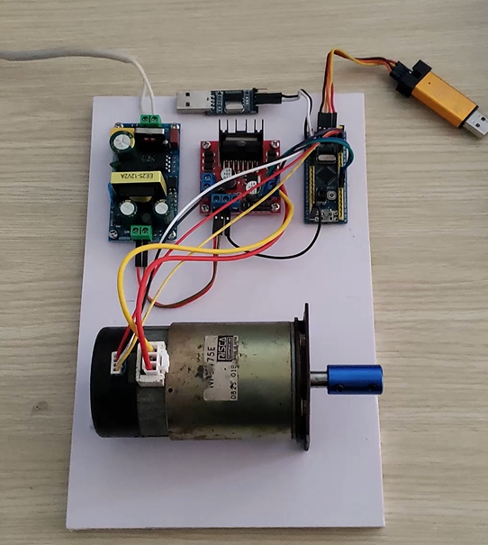
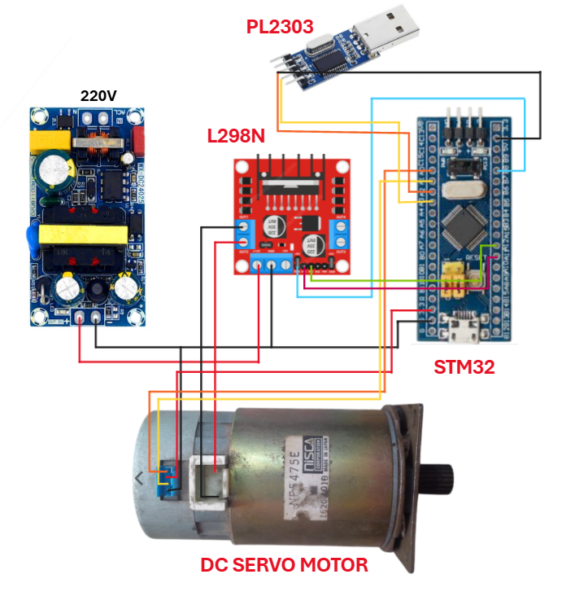
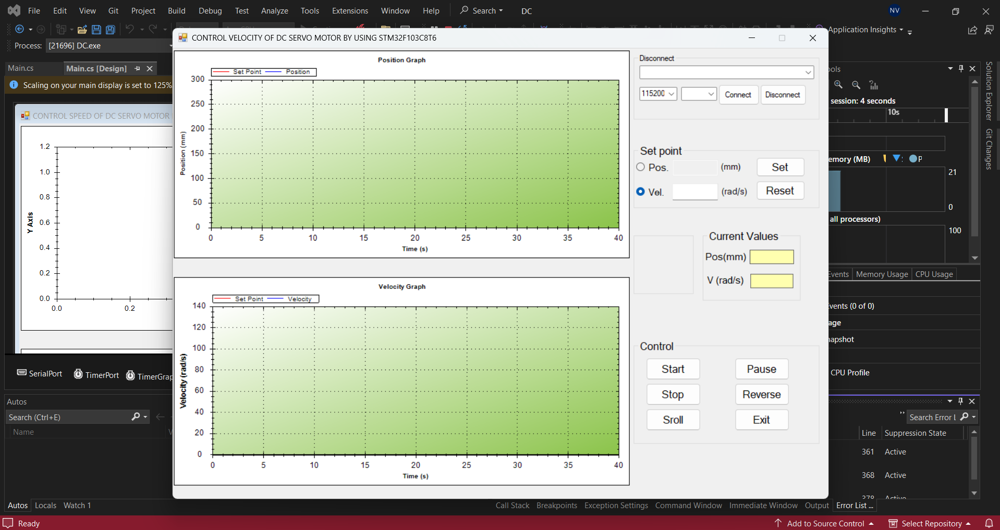
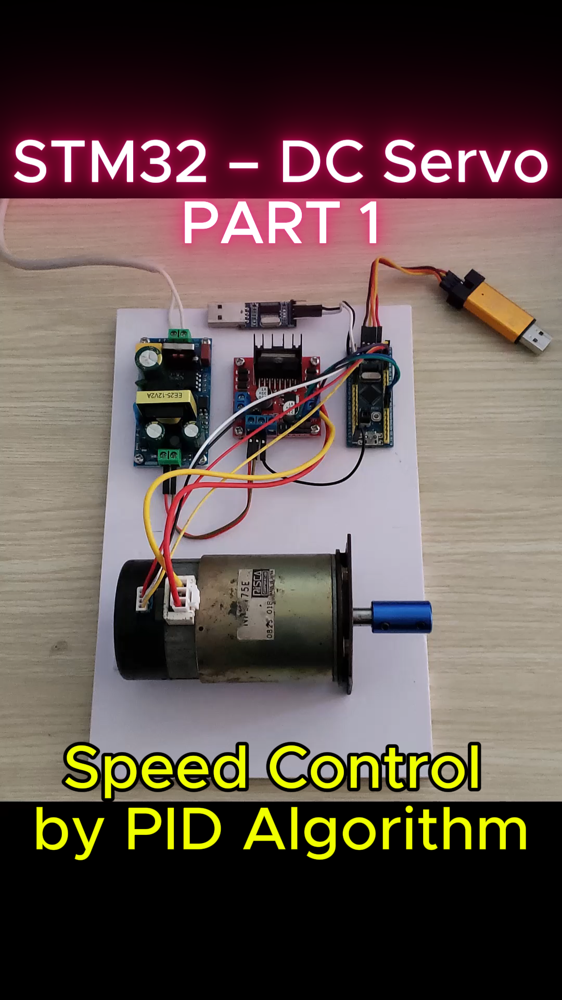

# 🚀 STM32 | Speed Control Using PID Algorithm

Author: **Kaël Shelby** (VTN)  

## 📖 1. Introduction
This project implements **DC Servo Motor NF5475E speed control** using a **PID algorithm** on the **STM32F103C8T6** microcontroller.  
The system integrates an **L298N H-Bridge motor driver**, a DC power supply, and a control interface developed in **Visual Studio (C# WinForms)**.  

The application provides the following functionalities:  
- Configure the desired motor speed (**Setpoint**).  
- Display the actual motor speed (**Current Speed**).  
- Start/Stop motor operation.  
- Plot real-time charts comparing setpoint and measured speed.  
- Log historical data for PID analysis and tuning.  

<div align="center">
  
</div>

---

## 🛠️ 2. Hardware Requirements
To build this project, the following components are required:
- STM32F103C8T6 (Blue Pill)  
- L298N Motor Driver  
- Breadboard + jumper wires  
- DC Servo Motor: NF5475E  
- Power Supply: 220V AC → 12V DC  
- USB-to-UART Adapter (PL2303)  

---

## 🔌 3. Circuit Connections
  

### 📌 Encoder (NF5475E → STM32F103C8T6)
| Encoder Pin | STM32 Pin | Function |
|-------------|-----------|----------|
| VCC (5V)    | +5V       | Power supply |
| GND         | GND       | Ground |
| Channel A   | PA0       | TIM2_CH1 (Encoder Input A) |
| Channel B   | PA1       | TIM2_CH2 (Encoder Input B) |

---

### 📌 UART Communication (PL2303 → STM32)
| PL2303 Pin  | STM32 Pin       | Function |
|-------------|----------------|----------|
| TXD         | PA3 (USART2_RX) | Receive data |
| RXD         | PA2 (USART2_TX) | Transmit data |
| GND         | GND             | Common ground |

---

### 📌 H-Bridge Driver (L298N → STM32)
| L298N Pin   | STM32 Pin      | Function |
|-------------|----------------|----------|
| IN1         | PA11           | Motor direction control |
| IN2         | PA12           | Motor direction control |
| ENA (PWM)   | PB8 (TIM4_CH3) | Motor speed (PWM signal) |
| VCC (12V)   | 12V DC         | Motor power |
| GND         | GND            | Common ground |

---

## 📜 4. User Interface
  

---

## 🎥 5. Demo and Results
👉 [Watch the demo video](https://www.tiktok.com/@kshelbyiot/video/7537173573891345672?is_from_webapp=1&sender_device=pc&web_id=7500959777037518344)

<p align="center">
  <a href="https://www.tiktok.com/@kshelbyiot/video/7537173573891345672?is_from_webapp=1&sender_device=pc&web_id=7500959777037518344">
    
  </a>
</p>

## 🚀 6. Getting Started
**1. Clone the project from GitHub**  
   ```bash
   git clone <url>
   ```
**2. Open the project with Keil C (uVision)**
- Main source file: main.c

**3. Connect hardware according to the diagram in Section 3**

**4. Flash the firmware using ST-Link V2 or USB-UART**

**5. Run the GUI Application (Visual Studio)**
- Select the correct COM port.
- Press Start to enable motor control.
- Set Setpoint to desired speed.
- Monitor Current Speed and real-time chart.

**6. Expected Results:**
- Motor speed stabilizes around the setpoint using PID control.
- Smooth response with reduced overshoot and steady-state error.
- GUI shows:
    - Setpoint vs. Current Speed graph.
    - Live motor control (Start/Stop, speed adjust).
    - Data logging for PID tuning.

## 🚀 7. Future Development
- Add Wi-Fi/IoT monitoring via ESP32 or MQTT broker.
- Integrate touchscreen HMI (TFT LCD) for local control.
- Upgrade driver (e.g., LMD18200, BTS7960) for higher power motors.


